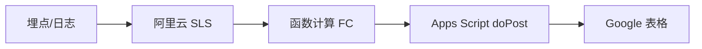

<div class="flex flex-col items-center justify-center min-h-[50vh] text-center">

# 前端展示层工程化实践

**半圆环进度 · 骨架屏 · 用户反馈收集**

<div class="opacity-60 text-sm mt-8">用更少代码表达 UI，用现有基础设施打通数据</div>

</div>

---
layout: two-cols
---

# 目录与动机

<Toc text-sm maxDepth="1" class="text-sm" />

::right::

## 三块内容

| 板块 | 问题 | 目标 |
|------|------|------|
| **半圆环** | 环+字怎么少写？ | 少算少 DOM，样式层表达 |
| **骨架屏** | 少维护一套假界面？ | 与真实 DOM 同构 |
| **用户反馈** | 不上后端表怎么收？ | 复用日志，少联调 |

**为何单独讲**：展示层需求多；常见写法 **重复多、双轨设计稿、联调贵**；三案共性 → **样式系统 / 日志 / 表格** 等平台能力优先。

---

# Part 1 · 半圆环 — 目标效果

**效果**：环 + 百分比居中；色、厚、进度可配。

<div class="flex justify-center py-4 scale-95 origin-top">
  <div class="flex flex-center text-4xl size-40 shrink-0 ring-progress rp-w-4 rp-b-transparent rp-a-[#16a34a]" :style="{ '--ring-percent': 72 }">72%</div>
</div>

- 视觉：**环与数字同轴居中**，避免「环一套、字一套」的微调成本。
- 配置：进度用 CSS 变量（如 `--ring-percent`），颜色/粗细走 **原子 class**，便于主题与 A/B。

---

# Part 1 · 半圆环 — 常规写法

**常规**：`relative` + `svg` 绝对定位 + `circle` + `stroke-dashoffset` 与百分比换算；多端阴影/颜色分支多。

```tsx
<div className="relative size-[44px] shrink-0">
  <svg width="44" height="44" viewBox="0 0 44 44" className="absolute inset-0">
    <circle cx="22" cy="22" r={radius} strokeWidth={3} fill="none"
      strokeDasharray={circumference} strokeDashoffset={strokeDashoffset} />
  </svg>
  <div className="absolute inset-0 flex items-center justify-center">
    <p>{Math.round(normalizedPercent)}<span>%</span></p>
  </div>
</div>
```

**小结**：逻辑正确但 **节点多、计算多、换肤分散**；适合作为「为何要上样式层抽象」的对照。

---

# Part 1 · 半圆环 — Uno 预设与对比

**优化**：`ring-progress` + `rp-*` + `--ring-percent`，`uno.config.ts` 收敛几何与语义。

```tsx
<div
  className="flex flex-center text-4xl size-40 shrink-0 ring-progress rp-w-4 rp-b-transparent rp-a-[#16a34a]"
  style="{ '--ring-percent': 72 }"
>
  72%
</div>
```

**换肤**：只改 `rp-b-*` / `rp-a-*`，不动 SVG 逻辑。

| 维度 | SVG 手写 | Uno 组合 |
|------|----------|-----------|
| 代码量 | 多节点+计算 | 单层+变量 |
| 换肤 | stroke/filter 分散 | 换 `rp-*` |
| 风险 | 算错周长/offset | 预设需文档化 |

<div class="flex justify-center gap-8 pt-2 scale-90">
  <div class="flex flex-col items-center text-xs opacity-70">默认底</div>
  <div class="flex flex-center text-3xl size-32 shrink-0 ring-progress rp-w-4 rp-b-transparent rp-a-[#16a34a]" :style="{ '--ring-percent': 72 }">72%</div>
  <div class="flex flex-center text-3xl size-32 shrink-0 ring-progress rp-w-4 rp-b-[#9ca3af] rp-a-[#16a34a]" :style="{ '--ring-percent': 72 }">72%</div>
</div>

<style>
  .slidev-layout p {
    margin-top: 0.5rem;
    margin-bottom: 0.5rem;
  }
  .slidev-layout td, .slidev-layout th {
    padding-top: 0.25rem;
    padding-bottom: 0.25rem;
  }
  .slidev-layout h1 {
    margin-bottom: 0.5rem;
  }
</style>

---

# Part 2 · 骨架屏 — 常规（双轨）

**常规**：`loading ? <Skeleton/> : <Real/>` — 两套 DOM；改版要双改；常要单独骨架稿。

```tsx
{isLoading && <AlphaPicksDetailsSkeleton />}
{!isLoading && !error && opportunity && (
  <AlphaPicksDetails {...data} />
)}
```

**代价**：骨架与真实布局 **易漂移**；设计常要单独骨架稿；测试要覆盖两套分支。

---

# Part 2 · 骨架屏 — 同构（group + data-loading）

**优化**：`group` + `data-loading` + `group-loading:*`，**始终真实结构**，loading 只换视觉。

```tsx
<div className="group" data-loading={isLoading}>
  <p className="body_m group-loading:skeleton group-loading:rounded-1">{subtitle}</p>
  {/* 列表、头像等同理 */}
</div>
```

**要点**：占位尺寸用 **设计 token** 固化；注意 **读屏**（不要把整块真实内容长期 `aria-hidden`）。

---

# 骨架屏 — 对比

| 维度 | 独立 Skeleton | group + data-loading |
|------|----------------|----------------------|
| 结构 | 易与线上一致性差 | **与线上一致** |
| 维护 | 双份布局 | **一套** |
| 设计 | 常要单独稿 | token 定占位尺寸 |
| 代价 | 分支清晰 | 需规范 + a11y 注意 |

---

# Part 3 · 用户反馈 — 后端路径与痛点

**常规路径**：前端 → API → 库/表 → 导出。

**痛点**：表结构 + 接口 + 权限 + 发版才能联调；开发期 **mock**；每次反馈打接口有 **成本/限流**。

**本方案前提**：已有 **前端日志 → 阿里云 SLS**（与线上排障同源）。

---

# Part 3 · 用户反馈 — 步骤与收益

1. 弹窗内 **结构化日志**（固定前缀，便于 `getLogs` query）
2. **不依赖后端表** 存反馈；开发照常打日志
3. 上线：**FC 定时** 拉 SLS → 解析行 → **POST Apps Script** → `setValues` 追加表格

**收益**：零后端联调验证格式；与排障 **同一条 SLS**；批处理 **摊薄** 写表成本。

---

# Part 3 · 用户反馈 — 数据流



---

# FC：从 SLS 拉取与解析

**SLS 查询（示意）**

```js
const cancelLogs = await sls.getLogs('osp-web', CANCEL_SUBSCRIPTION_LOG_STORE, from, to, {
  query: 'content: "[CancelFeedbackSurveyModalContent] User submitted feedback"',
  line: 100,
})
```

解析为 `[时间,选项,留言,userId,邮箱,地区,UA…]`，与 App 反馈合并后 `fetch(scriptUrl, { method: 'POST', body: JSON.stringify({...}) })`。定时触发 FC；失败重试与告警与现有函数计算实践对齐。

---

# Apps Script：表格写入

**表格 `doPost`（示意）**

```js
function doPost(e) {
  var body = JSON.parse(e.postData.contents)
  // getSheetByName → getLastRow+1 → setValues 追加
  return ContentService.createTextOutput('Success')
}
```

Script 配额、幂等/去重键（如 `logId`）需在解析层约定；异常返回便于 FC 侧重试。

---

# 优势与边界

**优势**

| 点 | 说明 |
|----|------|
| 迭代 | 改解析与表头为主 |
| 成本 | 无「每次反馈」写库；定时批跑 |
| 可观测 | 与监控同 SLS |

**边界**

- **合规**：PII、脱敏、保留周期对齐法务
- **可靠**：FC 重试、Script 配额、幂等/去重
- **密钥**：AK 走环境变量 / RAM，勿入库

---

# 三条线收束

1. **半圆环**：样式组合代 SVG 管线，换肤换 class。
2. **骨架屏**：同 DOM + `group-loading`，代双份组件。
3. **反馈**：日志 + FC + 表格，代「先上后端再联调」。

**讨论**：Uno 预设命名、骨架规范、SLS 列与表头设计。

---
layout: center
class: text-center
---

# 谢谢
